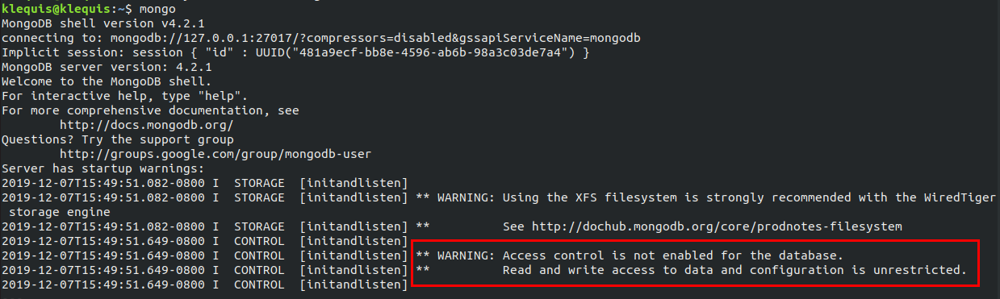

In this section you will install and configure [MongoDB](https://mongodb.com). We will be using the free Community Edition on your local development machine. In a later chapter, we will use [MongoDB Atlas](https://www.mongodb.com/cloud/atlas) for the production version of our application.

> **Import Note**
>
> This is a suitable configuration for a development environment. However, it is not secure enough for production use and should only be use on a machine that is behind a router which does not allow incoming requests (usually the default for routers).
>
> If you built and are using the virtual machine from [Building a Ubuntu Desktop Virtual Machine with VirtualBox](https://klequis.io/ubuntu-vm-virtualbox/) and have not changed the default network settings, you are well protected.

> [MongoDB University](https://university.mongodb.com/) is free and a great way to learn MongoDB!

## Definitions

Here definitions for terms used in this section.

- **Document:** A record in a MongoDB collection. If you are familiar with relational databases, it is roughly equivalent to a row in a table.
- **Collection:** A grouping of MongoDB Documents. If you are familiar with relational databases, it is roughly equivalent to a table.
- **Resource:** A resource can be a database, collection, set of collections or a cluster.
- **Action:** An action specifies an operation allowed on a resource. For example 'find', 'create' or 'insert' on the 'todo' database.
- **Privilege:** A privilege consists of a specified resource and the actions permitted on it.
- **Role:** A set of privileges. A role can contain one or more privileges. It can also contain other roles, in which case granting the role to a user applies the privileges in the contained role.
- **Built-in roles:** Built-in roles are roles that come with MongoDB by default. A complete list of built-in roles can be found at: [Built-In Roles](https://docs.mongodb.com/manual/reference/built-in-roles/).
- **User-defined roles:** User-defined roles are roles that are created by a MongoDB user. You use them to customize privileges according to your needs. Read more about user-defined roles at: [User-Defined roles](https://docs.mongodb.com/manual/core/security-user-defined-roles/).
- **Role-Based Access Control:** With role-based access control a user is granted one or more roles that determine the users access to resources and operations. Read more at: [Role-Based Access Control](https://docs.mongodb.com/manual/core/authorization/#role-based-access-control).
- **Authentication Database:** You create a given user in a given database and that becomes the authentication database for the user. However, a user's privileges are not limited to that database. You can assign it roles in other databases as well. Read more at: [Authentication Database](https://docs.mongodb.com/manual/core/security-users/#user-authentication-database).

---

## MongoDB Local Install

MongoDB has easy to follow and up to date instructions for installing the Community Edition on Ubuntu. Follow the instructions at [Install MongoDB Community Edition](https://docs.mongodb.com/manual/administration/install-community/) before proceeding with the configuration below.

Once installation is complete start MongoDB.

```console
sudo systemctl start mongod
```

---

## Authentication is Not Enabled

Initially after installation access control is not enabled. This means authentication is not required to access MongoDB and an unauthenticated user has full control. Once you enable access control users must authenticate. Before creating users let's take a quick look the current lack of authentication. Start the Mongo Shell:

```console
mongo
```

As you can see from the response in the image below, there are no restrictions on the user. We will address this issue after creating the first user.

<em>click on the image for a larger view</em>
<br><br>


---

> We will be using the Mongo Shell. If you are not familiar with it see [The Mongo Shell](https://docs.mongodb.com/manual/mongo/).

## Create superUser

The first user will be named 'superUser'. This user will have full access and will only be used for certain tasks.

If not already in the Mongo Shell type `mongo` to enter it.

```console
mongo
```

The `use admin` command switches you to the `admin` database. This will be the _authentication database_ for superUser.

```console
use admin
```

**Response:**

```console
switched to db admin
```
> You will see a `switched to db xyz` each time you use the `use` command.

Now use `createUser()` to create 'superUser' with the [root role](https://docs.mongodb.com/manual/reference/built-in-roles/#root).

```js
db.createUser(
  {
    user: "superUser",
    pwd: "karl",
    roles: [ "root" ]
  }
)
```

**Response:**

```console
Successfully added user: {
  "user" : "superUser",
  "roles" : [ "root" ]
}
```

---

## Enable Authentication

To enable authentication you need to modify a line in the `mongo.service` file.

> In the steps below use [GNU Nano](https://www.nano-editor.org/). However, you can use any editor you are comfortable with. If you want to know more about Nano, [visit its documentation](https://www.nano-editor.org/dist/latest/nano.html).

Exit the Mongo Shell by pressing <kbd>ctrl+c</kbd>

Use Nano to edit the file.

```console
sudo nano /lib/systemd/system/mongod.service
```

Find this line.

```
ExecStart=/usr/bin/mongod --config /etc/mongod.conf
```

Add `--auth` to it so the full line is:

```
ExecStart=/usr/bin/mongod --auth --config /etc/mongod.conf
```

If you are not familiar with Nano, it is keyboard driven. The shortcuts are at the bottom of the editor. To save the file and exit Nano:

- <kbd>ctrl+o</kbd> then <kbd>enter</kbd> to write the file to disk
- <kbd>ctrl+x</kbd> to exit Nano

Next you need to reload system level configuration with the command:

```console
sudo systemctl daemon-reload
```

And then restart the `mongod` process.

```console
sudo systemctl restart mongod
```

---

## Verify Authentication

Re-enter the Mongo Shell.

```console
mongo
```

**Response:**

There is longer a warning about authentication.

```console
MongoDB shell version v4.0.10
connecting to: mongodb://127.0.0.1:27017/?gssapiServiceName=mongodb
Implicit session: session { "id" : UUID("f0f33c53-812d-4db6-b4d2-a7eb30aa7048") }
MongoDB server version: 4.0.10
```

---

## Login as 'superUser'

If you are already in the Mongo Shell, exit using <kbd>ctrl-c</kbd>.

Use the below command to login as 'superUser'. The command options are:
- `-u superUser`: Login as user 'superUser'.
- `-p`: Prompt for password.
- `--authenticationDatabase admin`: Authenticate using the `admin` database.

```console
mongo -u superUser -p --authenticationDatabase admin
```

> **Security Tip:**
>
> You could include your password in the above command as `-p yourPassword` but this would put your password in the [bash](https://www.gnu.org/software/bash/) history file which can be read by an attacker. Don't do it!.

---

## Create testUser

If you are not already logged in as 'superUser', follow the steps in the section above.

Switch to `todo-test`

```console
use todo-test
```

Now create testUser. The command specifies:

- `user: "testUser"`: The username is 'testUser'.
- `pwd: "karl"`: The user's password is 'karl'.
- `roles: [ { role: "readWrite", db: "todo-test" } ]`: The user is granted the [readWrite](https://docs.mongodb.com/manual/reference/built-in-roles/#readWrite) role in the `todo-test` database. Unlike superUser, testUser's privileges are only granted for the `todo-test` database.

Create 'testUser'

```js
db.createUser(
  {
    user: "testUser",
    pwd: "karl",
    roles: [ { role: "readWrite", db: "todo-test" } ]
  }
)
```

**Response:**

```console
Successfully added user: {
	"user" : "testUser",
	"roles" : [
		{
			"role" : "readWrite",
			"db" : "todo-test"
		}
	]
}
```

### Verify 'testUser'

If you are still in the Mongo Shell exit using <kbd>ctrl-c</kbd>

Login as testUser.

```console
mongo -u testUser -p --authenticationDatabase todo-test
```

Switch to `todo-test`.

```console
use todo-test
```

Add one todo.

```js
db.todos.insertOne({ title: 'todo1', completed: false })
```

**Response:**

```console
// Your ObjectId will be different

{
 "acknowledged" : true,
 "insertedId" : ObjectId("5cf316024766652dcde6f7b5")
}
```

Read the inserted todo.
```js
db.todos.find()
```

**Response:**

```js
// Your ObjectId will be different

{ "_id" : ObjectId("5de709fa170028214eb1b060"), "title" : "todo1", "completed" : false }
```

---

## Create 'devUser'

Login as superUser again.

Switch to `todo-dev`.

```console
use todo-dev
```

Create 'devUser'.

```js
db.createUser(
  {
    user: "devUser",
    pwd: "karl",
    roles: [ { role: "readWrite", db: "todo-dev" } ]
  }
)
```

**Response:**

```console
Successfully added user: {
	"user" : "devUser",
	"roles" : [
		{
			"role" : "readWrite",
			"db" : "todo-dev"
		}
	]
}
```

### Verify 'devUser'

If you are still in the Mongo Shell exit using <kbd>ctrl-c</kbd>

Login as 'devUser'

```console
mongo -u devUser -p --authenticationDatabase todo-dev
```

Switch to `todo-dev`

```console
use todo-dev
```

Insert one todo.

```js
db.todos.insertOne({ title: 'todo1', completed: false })
```

**Response:**

```console
{
 "acknowledged" : true,
 "insertedId" : ObjectId("5cf316024766652dcde6f7b5")
}
```

Read the inserted document.

```js
db.todos.find()
```

**Response:**

```console
{
  "_id" : ObjectId("5de728de0d36cc3a5b23e03e"),
  "title" : "todo1", "completed" : false
}
```

---

## MongoDB Commands

Here is a list of commands for controlling MongoDB on your Ubuntu VM.

```
// Start MongoDB
sudo systemctl start mongod

// Stop MongoDB
sudo systemctl stop mongod

// Restart MongoDB
sudo systemctl restart mongod

// Get MongoDB status
sudo systemctl status mongod

// Start MongoDB when system starts
sudo systemctl enable mongodb // don't start automatically

// Do not start MongoDB when system starts
sudo systemctl disable mongodb // start automatically
```
---

# References
- [MongoDB](https://mongodb.com), MongoDB.
  - [MongoDB Atlas](https://www.mongodb.com/cloud/atlas), MongoDB.
  - [Authentication Database](https://docs.mongodb.com/manual/core/security-users/#user-authentication-database), MongoDB.
  - [Built-In Roles](https://docs.mongodb.com/manual/reference/built-in-roles/), MongoDB.
  - [createUser](https://docs.mongodb.com/manual/reference/command/#user-management-commands), MongoDB.
  - [Database Commands](https://docs.mongodb.com/manual/reference/command/), MongoDB

  - [Install MongoDB Community Edition](https://docs.mongodb.com/manual/administration/install-community/), MongoDB.
  - [readWrite](https://docs.mongodb.com/manual/reference/built-in-roles/#readWrite), MongoDB.
  - [Role-Based Access Control](https://docs.mongodb.com/manual/core/authorization/#role-based-access-control), MongoDB.
  - [Role Management Commands](https://docs.mongodb.com/manual/reference/command/nav-role-management/), MongoDB.
  - [root role](https://docs.mongodb.com/manual/reference/built-in-roles/#root), MongoDB.
  - [The Mongo Shell](https://docs.mongodb.com/manual/mongo/), MongoDB.
  - [User-Defined roles](https://docs.mongodb.com/manual/core/security-user-defined-roles/), MongoDB.
- [How To Securely Configure a Production MongoDB Server](https://www.digitalocean.com/community/tutorials/how-to-securely-configure-a-production-mongodb-server), DigitalOcean.
- [GNU Nano](https://www.nano-editor.org/), Nano.
- [bash](https://www.gnu.org/software/bash/), GNU Operating System.
