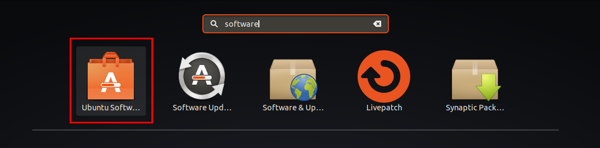
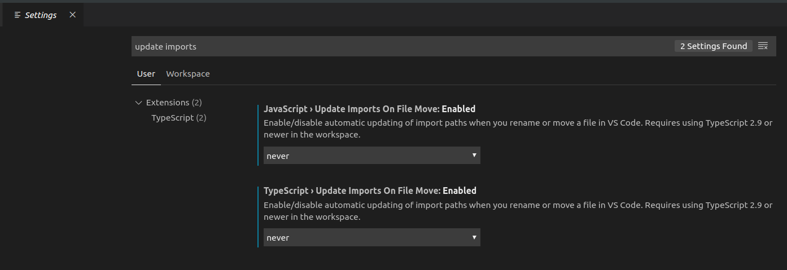
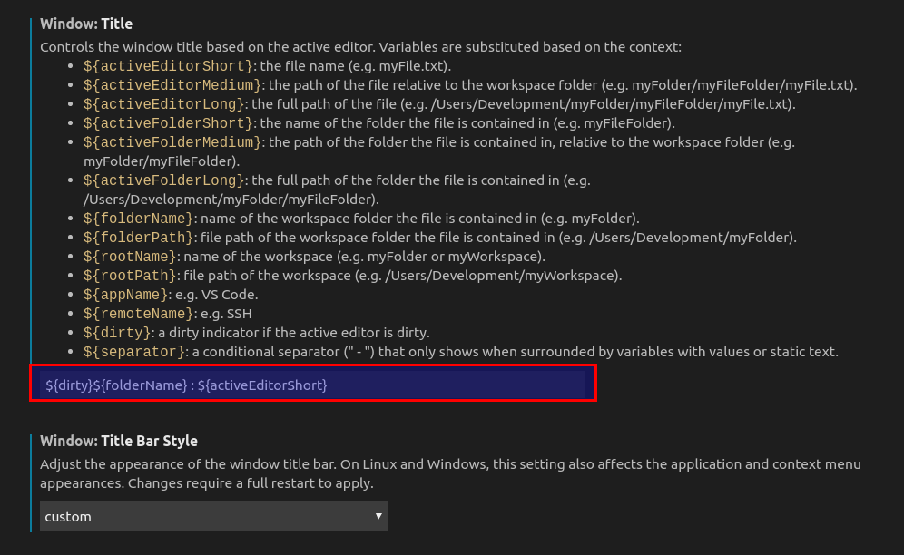
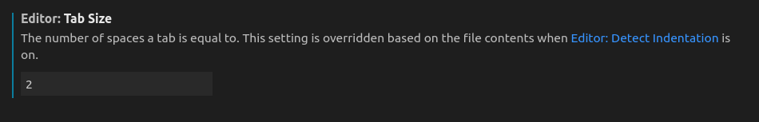

The best way to install Visual Studio Code on Ubuntu is to use Ubuntu Software. If you are not using Ubuntu you can find installation instructions [here](https://code.visualstudio.com/).



- Launch Ubuntu Software
- Type 'visual studio code'
- You will see two results. One with a blue logo and other with a green logo which is the 'insiders' editions.
- Choose the other one with the blue logo.
- Click install.

When the installation is complete launch VS Code.

## Suggested VS Code Extensions

The full power of VS Code is found in its rich [ecosystem of extensions](https://marketplace.visualstudio.com/vscode).

If you are following the [Full-Stack MERN Development Book](https://klequis.io/full-stack-mern-development-series/) you will be making use of Prettier. The other extensions are some of my favorites. Click on each link to see what they do.

To add extensions
- Click on the extensions icon.
- Use the search bar to find the desired extension.
- Click the green Install button.

Suggested extensions

- [Prettier - Code formatter](https://marketplace.visualstudio.com/items?itemName=esbenp.prettier-vscode)
- [Better Comments](https://marketplace.visualstudio.com/items?itemName=aaron-bond.better-comments)
- [Bracket Pair Colorizer](https://marketplace.visualstudio.com/items?itemName=CoenraadS.bracket-pair-colorizer)
- [npm Intellisense](https://marketplace.visualstudio.com/items?itemName=christian-kohler.npm-intellisense)


## VS Code Settings

You can open VS Code settings from the menu: File > Preferences > Settings. The best way to find a setting is to use the search bar.

### Update Imports On File Move

Last I tried it, this setting doesn't work well with absolute imports. Absolute imports look like:

```js
import MyComponent from 'src/components/MyCompoent'
```

The equivalent relative import would look like:

```js
import MyComponent from '../../src/components/MyCompoent'
```

Sometimes the `../../...` with relative references can get 3 or 4 levels deep and this gets hard to maintain. Absolute imports avoid that problem and I use them throughout the book.

Unfortunately, with Update Imports On File Move enabled, absolute references can get mutated into something very long, and it is time consuming to correct them all. To turn this feature off, change the two settings show below to 'Never'.



### Window Title

I don't find the default window title helpful when I have multiple projects open. Fortunately, VS Code offers great flexibility in how the window title appears. Below is how to change the title using my preference as an example

- Search for 'window title'.
- Set 'Window: Title Bar Style' to 'custom'.
- Click 'Restart' when prompted.

Once restarted, search for 'window title' again and then set its value to `${dirty}${folderName} : ${activeEditorShort}`.



## Editor: Tab Size = 2

If you are working by yourself, tab size is your personal preference, otherwise it is up to the team you are working with. The code samples in this [book](https://klequis.io/full-stack-mern-development-series/) all use 2 spaces. Making this the setting in VS Code will save you time reformatting.


