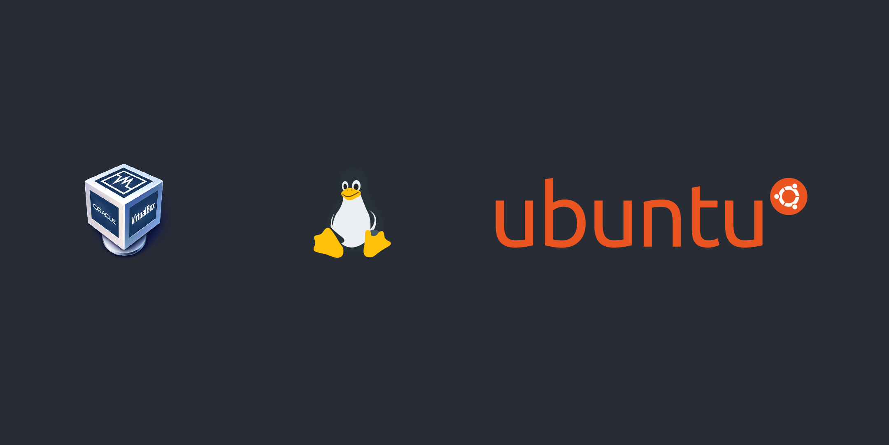


There are many reasons why you may want to build a Linux virtual machine. For me, as an employee of large corporations I was a Windows user for nearly 15 years and used mostly Microsoft development tools. When I left the corporate world and started using non-Microsoft tools I quickly realized that most 'how to' information on the web was for Mac or Linux. I either had to search harder to find Windows information or spend time figuring it out. Not wanting to buy a Mac at that point I tried Linux and have been using it for the past five years. While I originally used Ubuntu in a virtual machine, I eventually removed Windows and installed Ubuntu. I have Windows as a virtual machine because I love Microsoft Excel.

Here are a few other reasons to consider Linux:
- Your app will run on Linux in production and you want to do development on Linux as well to reduce the complications of development and deployment.
- You want to run a web and/or database server on Linux.
- You may be curious about a different operating system.
- Your a Windows or Mac user and you think or heard you _should_ learn Linux.
- Your broke and have older hardware. Linux generally is less resource intensive and runs on older hardware.

> Another good reason to use Linux is it is **free**. It is free as in you don't need to buy ($$) or pay to use it. It is free for personal and commercial use. It is free of intentional spyware. It is free in that you can study, modify and redistribute the source code.

## Definitions

A couple of words used frequently in this article:

- **Host:** - The host machine is the machine you install VirtualBox on. This will be a Linux, Mac or Windows machine running directly on your machines hardware.
- **Guest:** - The guest machine is the virtual machine that you run using VirtualBox.

## Prerequisites

### Memory

The short answer: 16 GB is plenty. 8 GB is likely enough. 4 GB isn't enough.

If you are going to be doing development on the guest you'll need to give the guest 4 to 6 GB of memory. Check you host system after a fresh boot to see how much free memory it has. The equation isn't really 'host memory after boot' + '4 to 6 for guest' = 'amount of memory on host'. The host will always need a little extra.

If you are short on memory you can dual-boot your machine. There are many good articles on how to do this. Try Googeling 'ubuntu 18.04 dual boot'.

### Processor

Any multi-core processor, Intel or AMD, made in the last 8 to 10 years should be good.

### Free hard drive space on the host
25 GB of free hard disk space on the host should be enough, but remember a full disk runs slow and it is best to have about 25% of the host disk unused.

## Download Ubuntu 18.04 Desktop LTS
- Go to: https://www.ubuntu.com/download/desktop
- Click 'Download' next to Ubuntu 18.04 LTS
- Wait for the download to complete or, if you have the bandwidth, move on to the next step while it downloads.

> Ubuntu 19.04 is beautiful to look at compared to 18.04, but it is a short-term release and therefore not widely supported by all of the apps and tools you will need.

## Installing VirtualBox
Go to the [VirtualBox download page](https://www.virtualbox.org/wiki/Downloads) and download the package for your host OS. Then follow the usual installation procedure for your host OS.

## Host Key & Stolen Shortcut Key Combinations

Before creating the virtual machine we need to change some VirtualBox settings related to the 'host key'.

The 'host key' is a key that when used specifies that you want to perform an action on the virtual machine container and not the OS running inside of the virtual machine. When using a Linux host the host key is set to <kbd>right ctrl</kbd>. Unfortunately, that means when using the virtual machine and you want to perform an action such as copy with <kbd>ctrl-c</kbd>, the key command is captured by VirtualBox and is not received by the guest OS. Hence, you can't copy with the keyboard :).

Given how I use a virtual machine I don't really have a need for a host key and I set it to 'None'. However, it could also be set to something else to suite your needs. Here is how to set it to 'None'.

- Go to File > Preferences > Input > Virtual Machine
- Change 'Host Key Combination' to 'None'

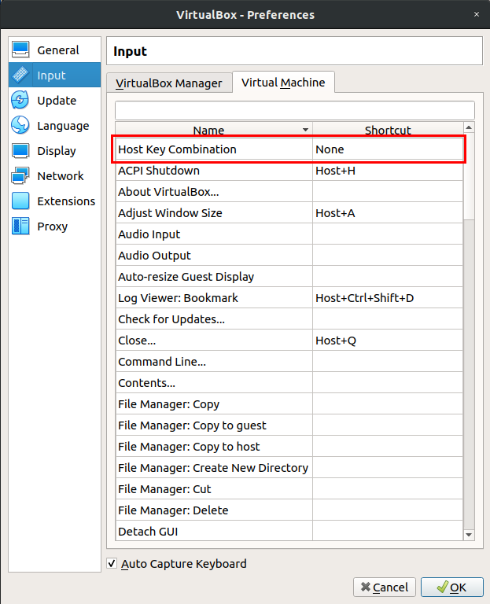


## Create the VM
- Open VirtualBox
- Select Machine > New

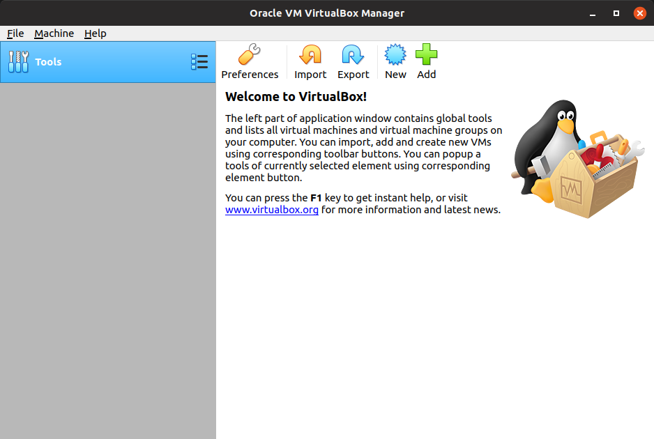

<div style='text-align: center'>

</div>


### Name and operating system
  - Name: something short and to the point
  - Machine Folder: the default is good
  - Type: Linux
  - Version: Ubuntu (64-bit)
  - Click Next

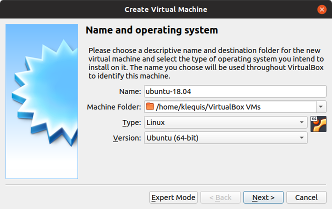

### Memory Size
  How much memory you allocate to the guest machine depends on how much memory you have on the host and what you will be doing with the VM. With 16 GB on my host I allocate 6 GB to the guest and can do software development with MongoDB running locally. I haven't experimented but my guess is 4 GB is enough.
  - Enter the memory in MB (e.g., 6 * 1024 MB = 6144 or 6 GB)
  - Click Next

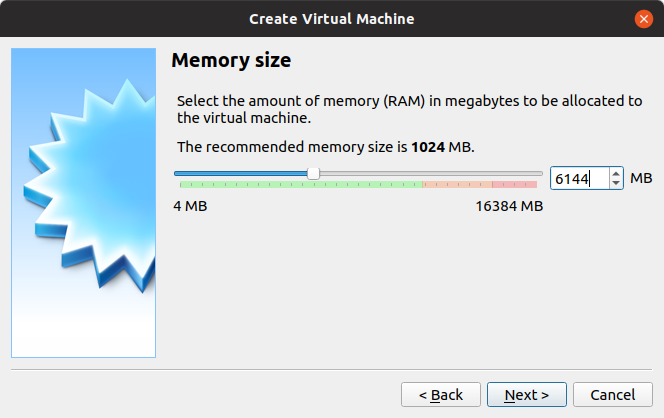

### Hard disk
  - Use the default: 'Create a virtual hard disk now'
  - Click Create

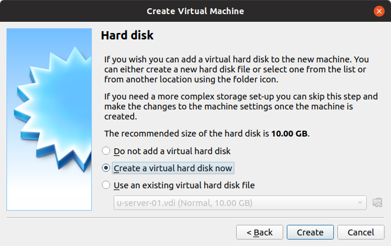

### Hard disk file type
  - Use the default: 'VDI (VirtualBox Disk Image)'
  - Click Next

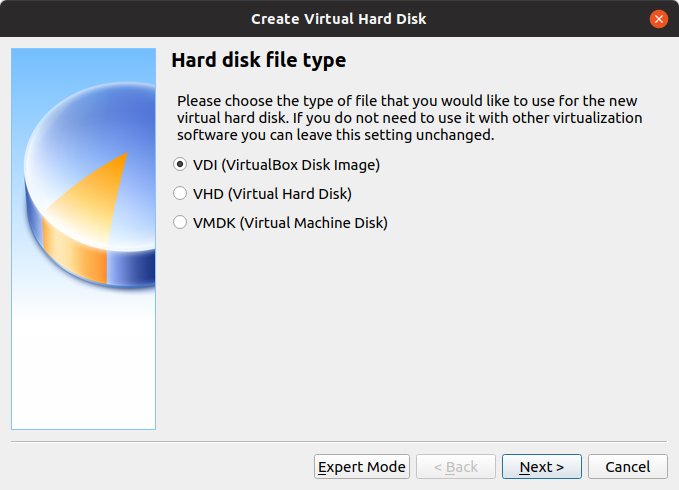

### Storage and physical hard disk
  - Use the default 'Dynamically allocated'
  - Click Next

      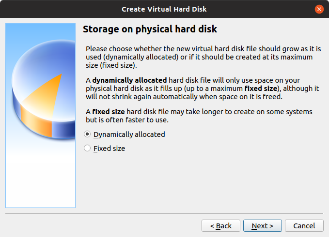

### File location and size
  'Dynamically allocated', chosen in the previous step, means the file size of the VM's hard drive will start at the minimum needed and grow as necessary up to the size you set in the current screen. This means you could enter 100 GB here and the initial size will still be under 3 GB. Setting 100 GB here means the VM's hard drive cannot grow larger than 100 GB. I recommend putting in a large number, but something significantly less then the available space on your host's hard drive.
  - Leave the location as is
  - Enter a size (eg. 100.00 GB)
  - Click Create

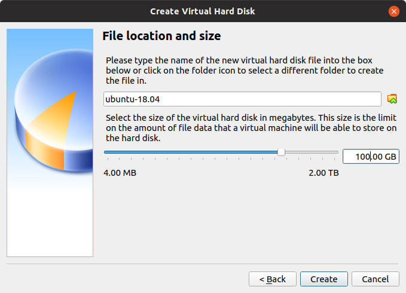

You now have a VM without an operating system. Essentially, it is a computer waiting to have an operating system installed.

## Virtual Machine Settings

A few changes will give you a better VM experience.

Right-click the new VM and select 'Settings...'

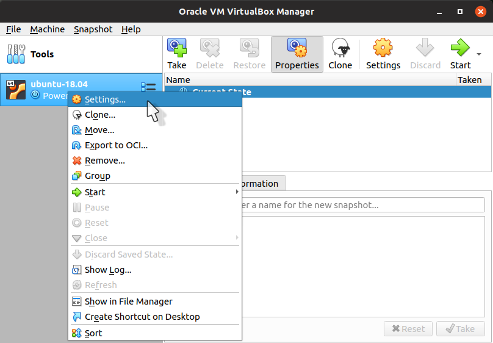

### General > Advanced
- Set both 'Shared Clipboard' and 'Drag'n'Drop' to 'Bidirectional'

This will allow you to copy and paste between the host and guest machines and greatly simplify your workflow.

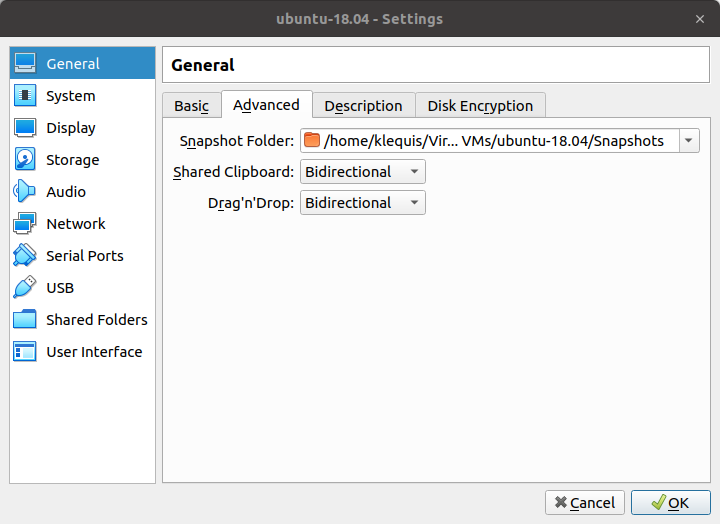

### System > Processor

By default the VM was given one processor. For my machine it says I have 8 CPUs. I actually have 4 cores with 2 threads per core. 2 CPUs is plenty, but feel free to experiment with more.

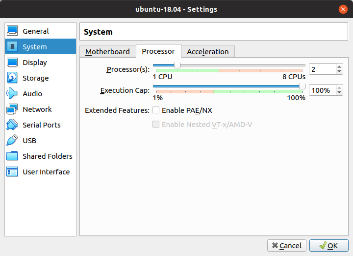

### Display > Screen

- Video Memory: 70 MB is good
- Check 'Enable 3D Acceleration'
- Click OK

> You can also use multiple monitors with the VM. Leave it at one for now.

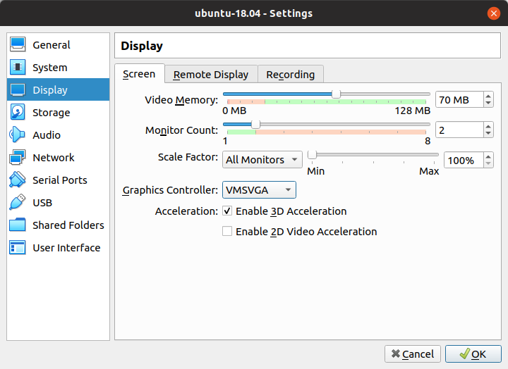

## Installing the OS

- In the left pane, double click the the VM you just created or right-click it and click Start

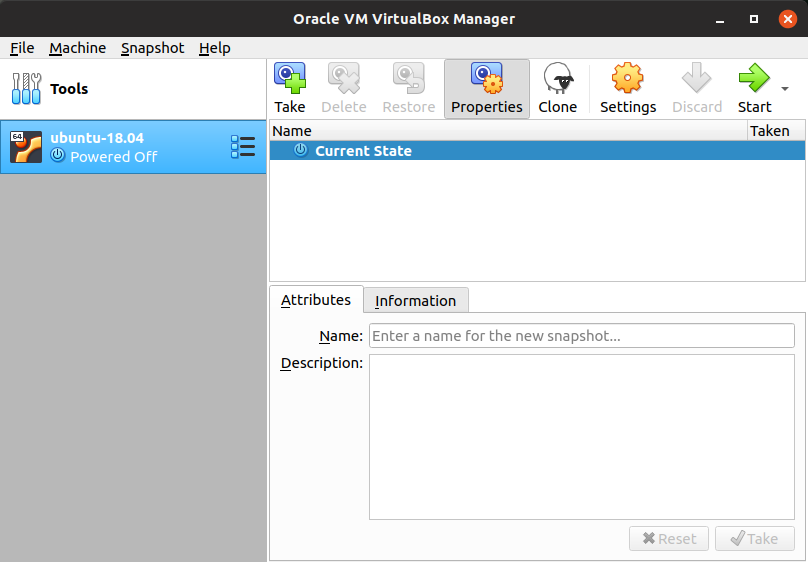

### Select start-up disk
- Click the folder icon and navigate to the ubuntu ISO file you downloaded
- Click Start

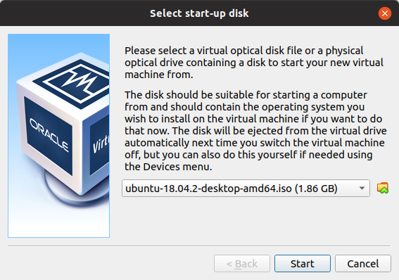

### Welecome
- Choose a language
- Click Install Ubuntu

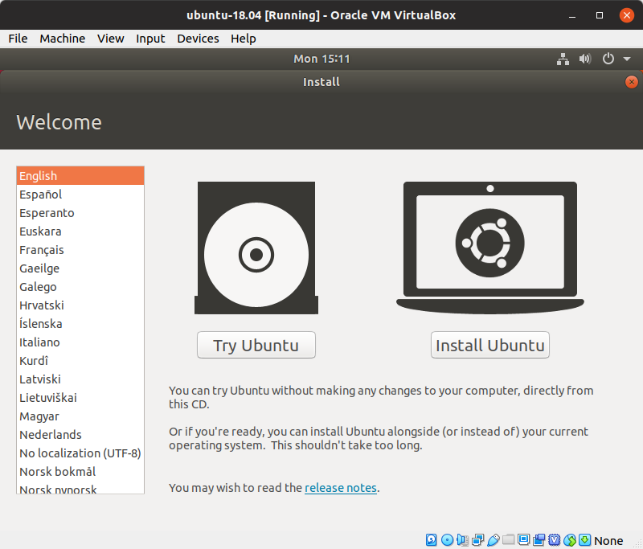

### Keyboard layout
- Select your desired keyboard layout and click Continue

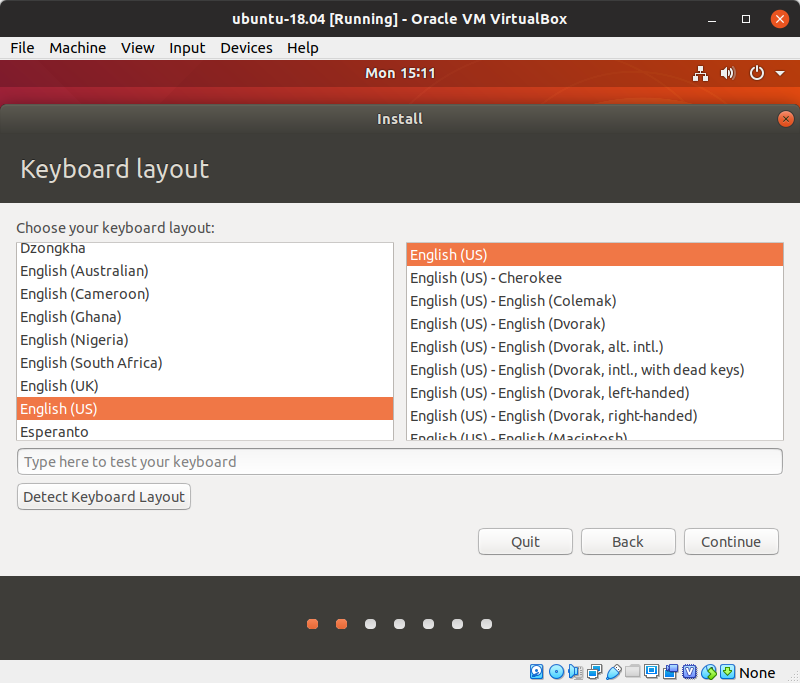

### Updates and other software
'Normal installation' will give you a full featured desktop experience with word processor, spreadsheet, media player and much more. 'Minimal installation' is, well, fewer applications but perfectly good for software development. If you are curious about the full Ubuntu experience, choose 'Normal installation'. If you want to save space choose 'Minimal installation'. You can always install additional software later.

With Ubuntu 16.04, the previous long term release, I experienced the build hanging if 'Download updates while installing Ubuntu' was checked and suggest you leave it unchecked. Ubuntu will prompt you shortly after installation is complete to install the updates.


'Install third-party software for graphics and Wi-Fi hardware and additional media formats' is generally beneficial. Make it checked.

- Select 'Normal installation' or 'Minimal installation'
- Un-check Download updates while installing Ubuntu
- Check 'Install third-party software for graphics and Wi-Fi hardware and additional media formats'
- Click Continue

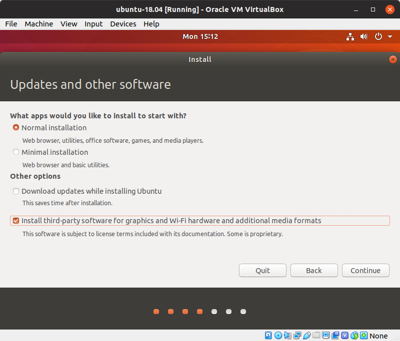

### Installation type
- Take the defaults
- Click Install Now

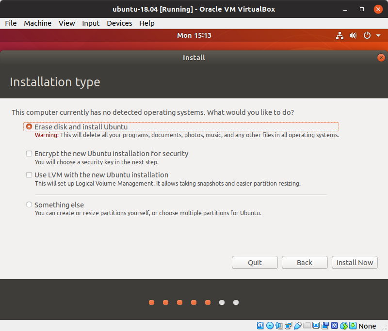

### Write the changes to disks?
- Click Continue

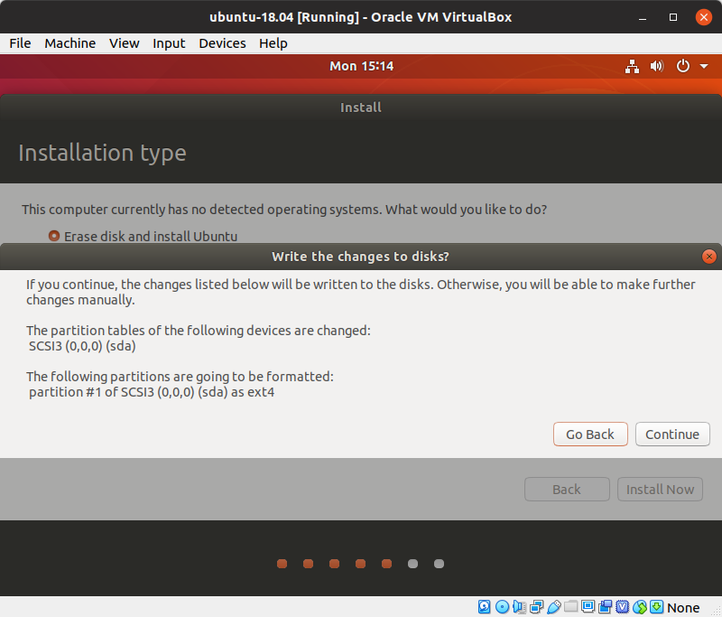

### Where are you?
- Select your timezone
- Click Continue

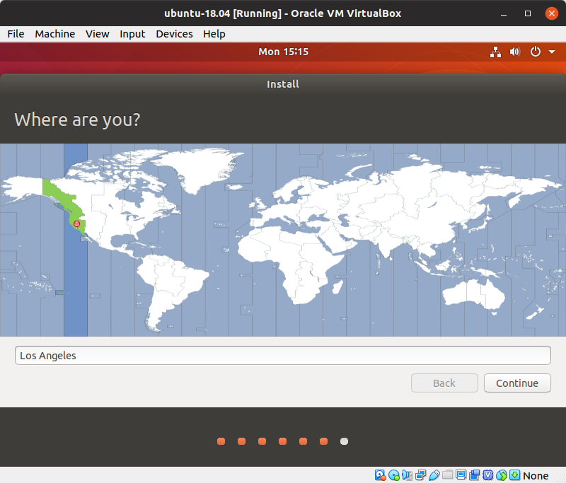


### Who are you?
- **Your name:** Enter any name
- **Your computer's name:** The most noticeable place this will show-up is on the command line. A long command line is harder to read so a short name is better. Enter a name for your computer.
- **Pick a username:** This will be the name of the first user created and will also show-up on the command line. Keeping it short applies here as well. Enter your username.
- **Choose a password:** Enter a password
- **Confirm your password:** Re-enter the password
- Click **'Log in automatically'** or **'Require my password to log in'** - your choice
- Click Continue

> NOTE: By default, the VM will not accept any incoming requests/connections. I also have a firewall on my host and, no surprise, my local network is behind a router. Additionally, if the host is locked, no one can log into the guest without the host password. Given all of that, I choose the convenience of using a short 4 character not so secret password, as well as 'Log in automatically'.

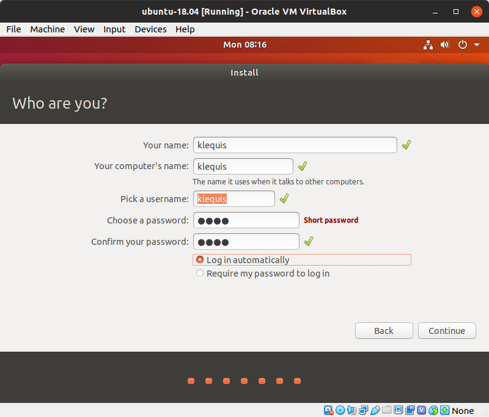

### Installation will now begin.

Ubuntu doesn't take very long to install but you likely have time to make a cup of coffee or tea.


Time for a break


<br />
<hr />
<br />

### Installation Complete

The installation of Ubuntu is complete.

- Click Restart Now

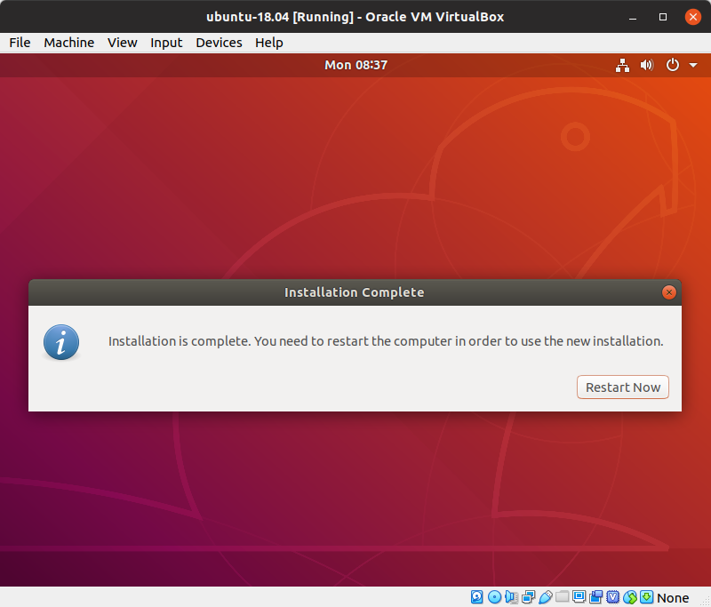


### Press Enter

You can ignore the message about removing the installation media. Ubuntu doesn't know you are installing it as a virtual machine. It thinks it is being installed from a media such as CD, DVD or USB drive. In our case, just press Enter.

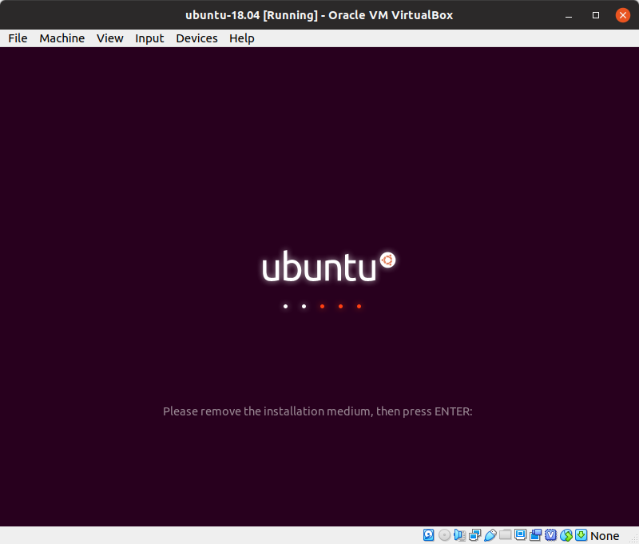

##  Software updates

At some point soon after installation, you will soon see a message from the Ubuntu software updater. This first update will be fairly large and likely contains security updates so you should install the updates as soon as you see this notice.

> Ubuntu updates are very painless. Other than this initial update, they are usually quick and mostly don't require a restart. I have never had a problem with an update.

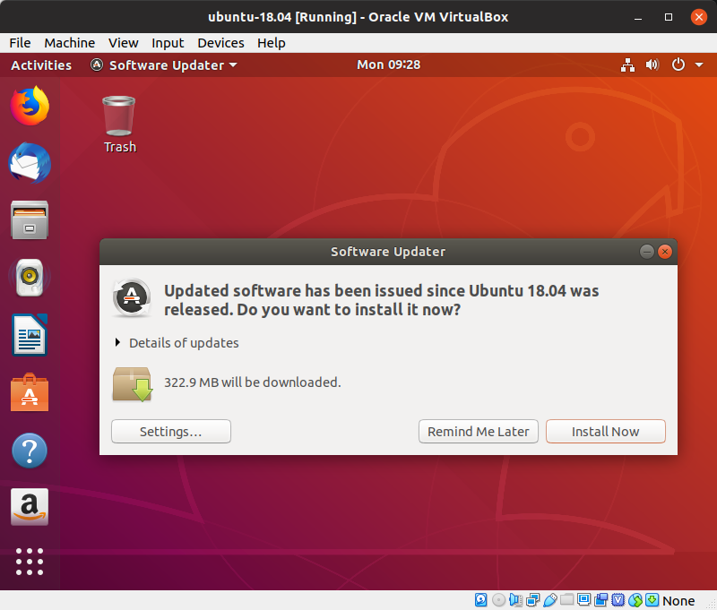

## All Done? Not Quite.

You now have a Ubuntu Virtual Machine but need to install VirtualBox 'Guest Additions' which will add crucial features to the VM. The most noticeable of these is that the virtual machine will display full-screen instead of the small box you have seen so far.

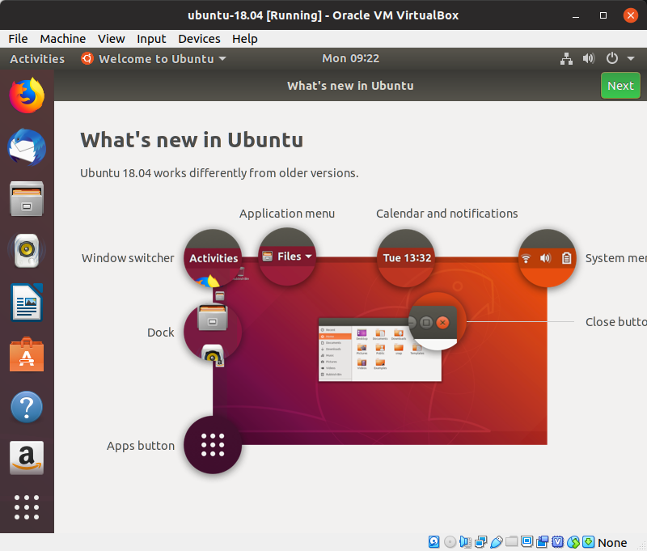

# Install Guest Additions

## Ubuntu Host

> If updates are installing you need to wait for them to finish before proceeding!

To install Guest Additions you first need to install the build-essential package. Open terminal and enter the below command:

```
sudo apt install build-essential
```

From the VirtualBox menu select 'Insert Guest Additions CD image...'

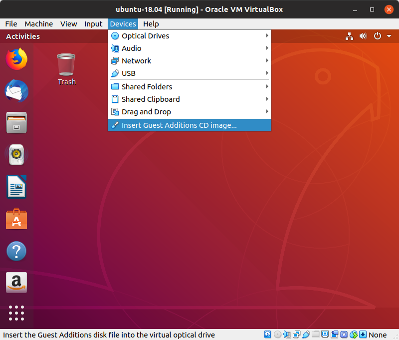

Click Run

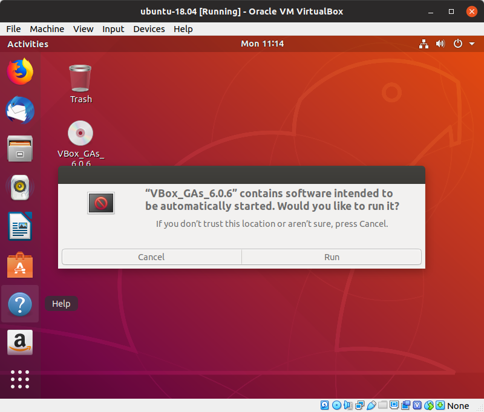

You will be asked to enter the current user's password.

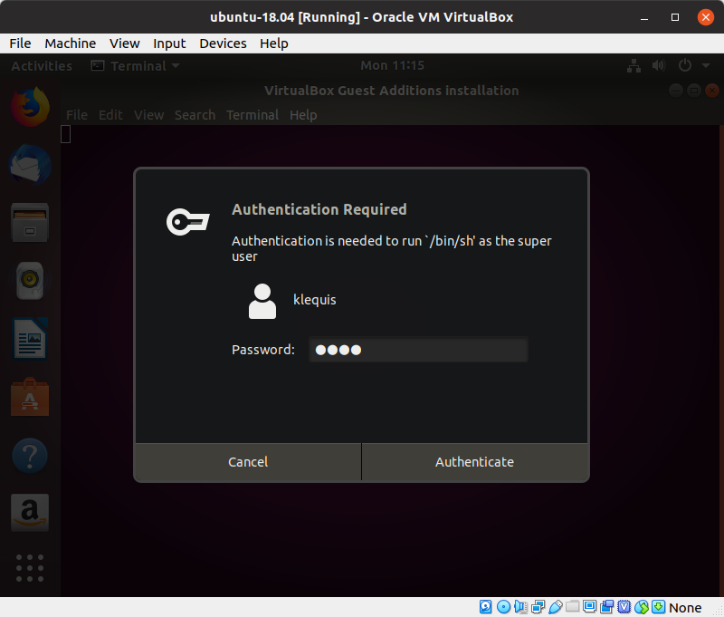


When guest additions is done installing close the terminal and restart the VM.

<hr />

### Did GuestAdditions fail to run?

Currently, if your host machine is Ubuntu there is a problem where you will be prompted to download GuestAdditions but the download fails with a network error. Here is a work-around:

**Install virtualbox-guest-additions-iso**

- On the host machine, install Synaptic Package Manager
- Start Synaptic Package Manager
- Click Search
- Search for 'virtualbox'
- Right-click on virtualbox-guest-additions-iso
- Click Mark for Installation
- Click Apply

**Add virtualbox-guest-additions-iso in Virtual Media Manager**
- In VirtualBox Manager click File > Virtual Media Manager...
- Select the Optical disks tab
- Right-click the blank space in the list and click Add...
- Navigate to /usr/share/virtualbox and select virtualbox-guest-additions-iso
- Click Open

**Install GuestAdditions**
- Go back to the instructions above for installing GuestAdditions in your virtual machine

<hr />

## Shared Folders

> Note (15-Nov-19): This section had an error which is now corrected. It originally said to add yourself to 'vboxusers' instead of vboxsf.

Shared folders allow you to access files on the host's file system from the VM. My view is it's best to keep all files used in the VM on the host. By doing so, if the VM were to become unavailable your files are still safe.

To make use of shared folders you need to add yourself to the guest machine's `vboxsf` group.

> Do this on the VM Guest, not the host.

```console
sudo adduser [yourUserName] vboxsf
```

So for me it would be:

```console
sudo adduser klequis vboxsf
```

Then go back to the VirtualBox Manager:
- Right-click your VM and select Settings...
- Select Shared Folders in the left pane
- On the right side of the dialog, click the folder button with the '+' sign.


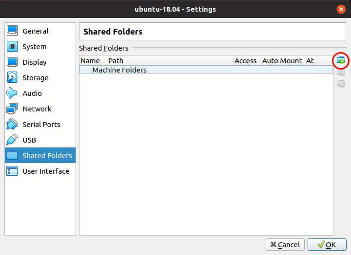

In the Add Share dialog:
- Choose the folder on your host machine you want to share. I simply share my home folder.
- By default the folder name will be the name of the folder you choose. You can change it if you want.
- Select **Auto-mount** so that the shared folder is available when the VM starts.

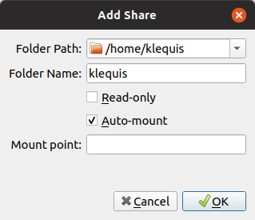

- Click OK
- Click OK in the Shared Folders dialog

> If your VM is running you will need to restart it for the change to take effect.

You now have access to the host file system in Files (Ubuntu file manager) and from other file system dialogs.

<hr />

## Optional Customization

Ubuntu is very customizable. You can completely change the appearance of the desktop and most apps as well. There is only one change I always make which is to switch to the dark theme. This is totally options, but here is how to do it.

- Click Activities
- Type 'software'
- Select Ubuntu Software
- With Ubuntu Software having the focus type GNOME Tweaks
- Click GNOME Tweaks
- Click Install
- Once installation is complete launch GNOME Tweaks
- Select Appearance on the left-hand side
- Set Applications to: Adwaita-dark

> Super key: In Linux the Windows key is called 'super'. Pressing it is the same as clicking Activities.

Finally, my keyboard has only one Windows key and it is on the right side. Ubuntu expects the Windows key to be on the left side and by default the one on the right side does nothing. To fix this:

- Launch GNOME Tweaks
- Select Keyboard & Mouse on the left-hand side
- Under Overview Shortcut choose Left Super or Right Super
