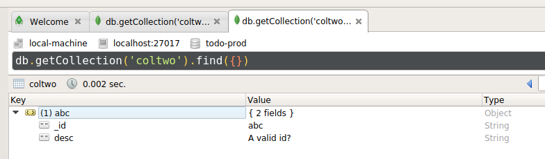

I spent some time reading questions and discussion of valid MongoDB IDs and there is considerable confusion with the [native drivers'](https://mongodb.github.io/node-mongodb-native/) [ObjectID.isValid() function](https://mongodb.github.io/node-mongodb-native/3.2/api/ObjectID.html#.isValid).

> The code for this post is at: [is-valid-hex-string-mongodb](https://github.com/klequis/is-valid-hex-string-mongodb)


## What's Valid?

If you let MongoDB or the driver create an ObjectID for you it will look like:
```
5ce819935e539c343f141ece
```

Here is the definition of `ObjectId` from the [MongoDB Glossary](https://docs.mongodb.com/manual/reference/glossary/index.html)

> A special 12-byte BSON type that guarantees uniqueness within the collection. The ObjectId is generated based on timestamp, machine ID, process ID, and a process-local incremental counter. MongoDB uses ObjectId values as the default values for _id fields.

I and a good number of other people mistakenly assumed that the native driver's `ObjectID.isValid` will check for an ObjectID, but that is not the case.

Here is a screenshot of a document I created in [Robo 3T](https://robomongo.org/) with an ID of 'abc'.



As you can see `abc` is a valid ID. 

So what is the full scoop? The answer can be found in the native driver's code [here (currently line 340)](https://mongodb.github.io/node-mongodb-native/3.2/api/node_modules_bson_lib_bson_objectid.js.html)


```js
/**
* Checks if a value is a valid bson ObjectId
*
* @method
* @return {boolean} return true if the value is a valid bson ObjectId, return false otherwise.
*/
ObjectID.isValid = function isValid(id) {
  if (id == null) return false;
  if (typeof id === 'number') {
    return true;
  }
  if (typeof id === 'string') {
    return id.length === 12 || (id.length === 24 && checkForHexRegExp.test(id));
  }
  if (id instanceof ObjectID) {
    return true;
  }
  if (id instanceof _Buffer) {
    return true;
  }
  // Duck-Typing detection of ObjectId like objects
  if (id.toHexString) {
    return id.id.length === 12 || (id.id.length === 24 && checkForHexRegExp.test(id.id));
  }
  return false;
};
```

Looking through the code you can see that
- Any number is valid
- A string is valid if it has a length of 12
- A string is also valid if it has a length of 24 and passes the regex test from [the drivers code (currently line 17)](https://mongodb.github.io/node-mongodb-native/3.2/api/node_modules_bson_lib_bson_objectid.js.html)

```js
var checkForHexRegExp = new RegExp('^[0-9a-fA-F]{24}$');
```
- It s a Buffer
- And finally, if it can be converted to a hex string and then pass the test

```js
return id.id.length === 12 || (id.id.length === 24 && checkForHexRegExp.test(id.id));
```

## How to check that an ID is a valid ObjectID

After digging around and seeing what other people are doing as well as what can be learned from the above MongoDB driver code, if you want to check for an ObjectID and not any of the other valid ID types, this seems to be the best approach:

```js
const checkForHexString = new RegExp('^[0-9a-fA-F]{24}$');

export const isValidHexIdString = id => {
  let _id = ''
  try {
    if (!id) {
      return false
    } else {
      typeof id !== 'string' ? (_id = id.toString()) : (_id = id)
    }
    return checkForHexString.test(_id)
  } catch (e) {
    red(e)
    return false
  }
}
```